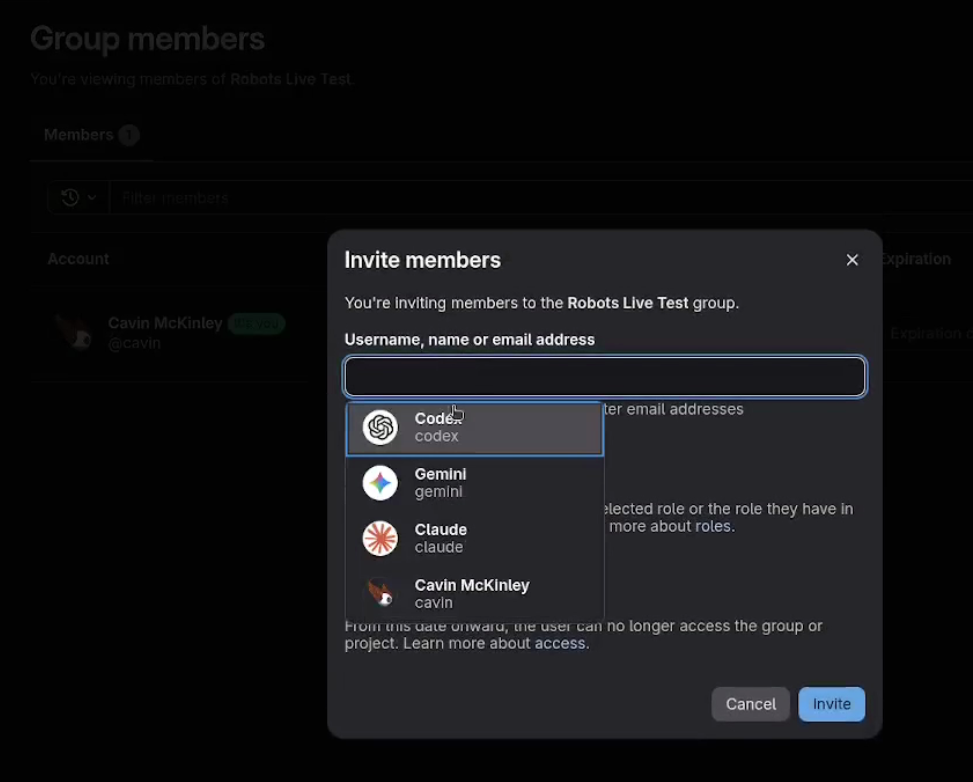

<!--
Robot Dev Team Project
File: README.md
Description: Repository overview and setup guide.
License: MIT
SPDX-License-Identifier: MIT
Copyright (c) 2025 MCKNLY LLC
-->

# Robot Dev Team: GitLab → LLM Agent Webhook Orchestration

<div align="center">
  
</div>

**Bring Your Own Agents (BYOA)** — Robot Dev Team is a containerized FastAPI service that consumes GitLab webhooks, enriches events with the GitLab CLI, and dispatches context-rich prompts to any CLI-based LLM agent via YAML routing rules.
Ships with adapters for Claude Code, Google Gemini, and OpenAI Codex, but any tool that accepts prompts on stdin can be wired in simply by replacing CLI command strings.
No need for separate pay-as-you-go API keys, use the command line agents you already have.

## Rationale

### Why GitLab?

GitLab is [open source](https://gitlab.com/gitlab-org/gitlab), and can be hosted locally in a [docker container](https://docs.gitlab.com/install/docker/). This provides you with a private, self-managed project repository with all the features you would expect from a modern SCM. But most importantly, GitLab's issue tracking, merge request, and conversation interface provides a rich _infinite context platform_ on which to work with your coding agents.
Track ideas, plans, work status, history...all without worrying about losing your state, blowing context windows, or misplacing sessions. All of your agents have access to the same working knowledge, in perpetuity. You can create as many agent dev accounts as you want without [TOS](https://docs.github.com/en/site-policy/github-terms/github-terms-of-service#b-account-terms) risk.
You can even allow your agents to @ each other, if you're token-uninhibited. 

### Why Docker?

Containerizing the webhook server and agent CLI tools provides agent isolation from the host system without the need for the agents to aggresively sandbox themselves. What this means: agents can run in YOLO mode with access to only the tools they need and the codebase. They can get their job done without approval, and without risk.

### Why Multiple Agents?

Using more than one agent provider (i.e. Claude, Codex, Gemini...) allows you to pit multiple language models against each other. You can fine-tune roles, get multiple opinions, and have them review each other. _Huge level up for workflows._

This platform follows a **BYOA** philosophy: it is not locked to any specific provider. Go ahead and have Kimi review Codex. Make Qwen handle merge requests. You _could_ also just use a single agent for everything, if you're old fashioned like that.

### Why CLI Harnesses?

Each agent CLI authenticates using your host account credentials, bind-mounted into the container. Agent operations bill to your existing subscription -- no separate API keys, no open-ended usage-based billing, and your plan's rate limits act as natural spending guardrails.
If you're already authenticated in the host CLI, your agents are ready to work, using their own native harnesses that were already purpose-built to produce.

## Features

- **BYOA** — Agent-agnostic by design. Route GitLab webhooks to Claude, Gemini, Codex, or any custom CLI agent (OpenCode, Goose...) using flexible, first-match YAML routing rules.
- **Event-driven agent orchestration** — GitLab webhooks triggered by repository events are processed by the router; mentioning an agent in issue or MR comments dispatches it with full event context, and multi-mention comments (or `@all`) fan out into separate, independent dispatches with per-mention event tracking.
- **On-demand project cloning** — Projects are cloned automatically on first webhook trigger, with namespace-aware paths and concurrent-clone protection — no manual repo setup required.
- **Automatic branch resolution** — The system detects the relevant branch from the webhook payload and checks it out before the agent starts work, including divergence handling, backup branch creation, and stale branch auto-cleanup.
- **Filesystem-enforced write protection** — Projects are dual-mounted (read-only and read-write); routes select which mount the agent receives, enforcing access control at the OS level rather than by convention.
- **`gitlab-connect` CLI wrapper** — An agent-aware wrapper around `glab` that handles per-agent authentication, credential rotation, git identity setup, and file-based content input for issues, MRs, and comments.
- **Template-based prompt injection** — Prompt templates with `${VARIABLE}` substitution pull real-time context from GitLab (issue body, MR diff, branch info) and inject it into agent task prompts.
- **Live streaming dashboard** — A real-time web UI with WebSocket-backed panes for agent stdout, thinking output, prompts, and system logs, plus a kill switch for runaway processes.
- **Structured run logging** — Every agent execution is captured as a JSON file (prompt, stdout, stderr, return code, branch context) with configurable retention and automatic pruning.
- **Webhook deduplication and queue management** — UUID-based event tracking with configurable TTL prevents duplicate processing; an in-memory async queue serializes dispatches.

### Demo
<div align="center">
  <a href="https://youtu.be/VEkyBA1mPms">
    
  </a>
</div>

## Table of Contents
- [Features](#features)
- [Quick Start](#quick-start)
- [Overview](#overview)
- [System Architecture](#system-architecture)
- [Key Components](#key-components)
- [Project Layout](#project-layout)
- [Prerequisites](#prerequisites)
- [Configuration](#configuration)
- [Local Development](#local-development)
- [Routing & Prompts](#routing--prompts)
- [Testing](#testing)
- [Dependency Management](#dependency-management)
- [Docker Deployment](#docker-deployment)
- [Logging & Observability](#logging--observability)
- [Security Considerations](#security-considerations)
- [Troubleshooting](#troubleshooting)
- [Additional Documentation](#additional-documentation)

## Quick Quick Start

This project has been heavily documented to make it agent-friendly. Clone it, point your agent at it, have it help you set it up. Shortcut!

## Quick Start

> **Before you begin:** _This assumes you already have a self-hosted GitLab CE instance. If you need to stand one up, see `gitlab/readme-gitlab.md` and `gitlab/docker-compose.gitlab.yml` for a reference deployment — it includes an entrypoint wrapper that automatically creates an admin token and configures webhook delivery on first boot._
Create GitLab user accounts for each agent you plan to use (`claude`, `gemini`, `codex`, etc.), generate a Personal Access Token (PAT) with `api` scope for each, and invite the agent accounts to your target project(s) with **Developer** role (Project > Members > Invite member).
For multi-project setups, add agents at the **Group** level so access is inherited automatically -- see `docs/GROUP_SETUP.md`. Agents cannot interact with projects they are not members of, even if webhooks are configured correctly.

### Linux (read this first as it applies to other platforms as well)
1. Install Node.js using `nvm` (ensures a modern LTS build) and then install the agent CLIs:
   ```bash
   curl -o- https://raw.githubusercontent.com/nvm-sh/nvm/master/install.sh | bash
   export NVM_DIR="$HOME/.nvm"
   [ -s "$NVM_DIR/nvm.sh" ] && \. "$NVM_DIR/nvm.sh"
   nvm install --lts
   npm install -g @anthropic-ai/claude-code @google/gemini-cli @openai/codex
   ```
   The CLIs will be available as `claude`, `gemini`, and `codex` on your `PATH`.  
   _note1: some of these agent CLIs are migrating to native installers. Consult the latest installation guides for each._  
   _note2: you can omit any of these agents from your config, just remove all references to that agent from your routing rules._
2. Authenticate each agent CLI under your user account so their configs live in `~/.claude`, `~/.gemini`, and `~/.codex`:
   ```bash
   claude    # follow the interactive prompts (Anthropic)
   gemini    # sign in with your Google account
   codex     # authenticate with your OpenAI account
   ```
   Run each command interactively once to seed credentials; Docker mounts the same directories so automation reuses your local auth. Using your personal subscription means agent operations stay under your existing plan limits. Requires a paid subscription for each provider you intend to use (or locally-hosted models if you're a cowboy).
3. Clone the repository and change into it:
   ```bash
   git clone https://github.com/mcknly/robot-dev-team.git
   cd robot-dev-team
   ```
4. Copy `.env.example` to `.env` and populate the required values:
   ```bash
   cp .env.example .env
   nano .env
   ```
   - Set the agent GitLab PATs (`CLAUDE_AGENT_GITLAB_TOKEN`, `GEMINI_AGENT_GITLAB_TOKEN`, `CODEX_AGENT_GITLAB_TOKEN`) generated from the agent accounts created in the prerequisite step above.
   - Set `GLAB_TOKEN` to your own PAT with `api` scope for the app process — used for procedural GitLab tasks (context enrichment, auto-unassign, termination comments) and is separate from the per-agent tokens.
   - Set `GLAB_HOST` to your GitLab instance hostname.
   - Set `GITLAB_WEBHOOK_SECRET` to a shared secret token (this must match the value configured in the GitLab webhook settings in step 9) - _optionally leave blank_.
   - Set `CLAUDE_MODEL`, `GEMINI_MODEL`, and `CODEX_MODEL` to the desired default model for each agent (e.g., `claude-opus-4-6`, `gemini-3.1-pro-preview`, `gpt-5.4`). These are required when the default `routes.yaml` references `${..._MODEL}` placeholders -- if your routes hard-code the model value or omit `--model`, the corresponding variable can be skipped.
   - Set `LOCAL_UID` / `LOCAL_GID` to your local user/group ID (use `id -u` / `id -g` - docker-compose defaults to 1000; mismatches will cause bind-mount permission errors).
   - See `docs/ENVIRONMENT.md` for the full variable reference.
   - To **omit a default agent**, remove its route entries from `routes.yaml`, remove it from `ALL_MENTIONS_AGENTS` (if set), and optionally remove its env vars and Docker volume mounts. See the "Removing an Agent" section in `docs/ADDING_AN_AGENT.md` for details.
5. Edit `docker-compose.yml` to set the project volume mount paths (the `./projects:/work/projects` lines) to a local directory that will serve as the working directory for project repositories. This directory can start empty — with `ENABLE_AUTO_CLONE=true`, projects are cloned automatically on first webhook trigger using the `<namespace>/<project-name>` structure. You can also pre-clone repositories here if preferred.
6. Configure routing rules for your GitLab username. Copy `config/routes.yaml` to `config/routes.local.yaml`, replace `your-username` with your GitLab username, and add `ROUTE_CONFIG_PATH=config/routes.local.yaml` to your `.env`. This keeps your local configuration separate from the shipped defaults.
7. Ensure your account can run Docker without `sudo`:
   ```bash
   sudo usermod -aG docker "$USER"
   newgrp docker    # or log out/in
   docker info      # verify access works without sudo
   ```
8. Start the containerized stack:
   ```bash
   docker compose up --build
   ```
9. Configure the GitLab webhook to point at `http://localhost:8080/webhooks/gitlab` (or your tunnel URL) and send a test event. See [`docs/GITLAB_WEBHOOKS.md`](docs/GITLAB_WEBHOOKS.md) for detailed webhook configuration including event selection and secret token setup, or [`docs/GROUP_SETUP.md`](docs/GROUP_SETUP.md) for automated webhook provisioning via File Hooks. Set `LIVE_DASHBOARD_ENABLED=true` in `.env` to enable the live dashboard at `/dashboard`. Set `DEBUG_RELOAD_ROUTES=true`, configure a route in your routes file (e.g., `config/routes.local.yaml`), trigger the event, confirm a run log appears on the dashboard and in `run-logs/`.

### macOS (with Docker Desktop)
1. Install Node.js via Homebrew and add the agent CLIs (follow latest guides)
2. Authenticate each CLI so credentials live under `~/.claude`, `~/.gemini`, and `~/.codex` (as above).
3. Install Docker Desktop for Mac and ensure it is running (`docker info` should succeed in a new terminal).
4. Clone the repository, configure `.env`, and edit volume mount paths as in steps 3-6 of the Linux section.
5. Launch the stack from the terminal:
   ```bash
   docker compose up --build
   ```
6. Configure & test the GitLab webhook as in step 9 of the Linux section. See [`docs/GITLAB_WEBHOOKS.md`](docs/GITLAB_WEBHOOKS.md) for full webhook setup details.

### Windows (WSL + Docker Desktop)
1. Install WSL2 (`wsl --install -d Ubuntu`) and Docker Desktop, enabling Docker WSL integration for your distribution.
2. Inside the WSL shell, install Node.js with `nvm` as in the Linux section.
3. Install & authenticate the agent CLIs as above.
4. Install Git and clone the repository inside the WSL filesystem (e.g., `/home/<user>/robot-dev-team`). Configure `.env` and edit volume mount paths as in steps 3-6 of the Linux section.
5. Make sure your WSL user belongs to the `docker` group (`sudo usermod -aG docker "$USER"` and `newgrp docker`), then start the stack:
   ```bash
   docker compose up --build
   ```
6. Configure the GitLab webhook to call `http://localhost:8080/webhooks/gitlab` (accessible from Windows via Docker Desktop) or point it at a tunnel URL. See [`docs/GITLAB_WEBHOOKS.md`](docs/GITLAB_WEBHOOKS.md) for full webhook setup details. Send a test event and verify a run log is written.

## Overview
GitLab projects can be configured to emit webhook events (merge requests, issues, comments). This service receives those events, optionally enriches them via `glab`, renders prompts from templates, and shells out to one or more agent CLIs configured per event type. Each agent can authenticate to GitLab via the bundled `glab-usr` helper and then post results back through the GitLab API via `gitlab-connect`, a custom helper script for wrapping `glab` and making it more agent-friendly.

## System Architecture
```
┌────────────┐      ┌─────────────┐      ┌────────────────┐      ┌────────────────┐      ┌─────────────┐
│ GitLab     │ ---> │ Webhook     │ ---> │ Event Router   │ ---> │ Trigger Queue  │ ---> │ Agent Runner│
│ Webhooks   │ POST │ Listener    │      │  (routes.yaml) │      │   (FIFO, async)│      │             │
└────────────┘      └─────────────┘      └────────────────┘      └────────────────┘      └─────────────┘
                                                                                         │
                                                                                         └───────┬────────────┬────────────┬───────────┐
                                                                                                 │ Claude CLI │ Gemini CLI │ Codex CLI │ ...
```

- Webhook listener: FastAPI endpoint validates secrets, deduplicates events, and normalizes metadata.
- Event router: Matches incoming events against YAML rules that specify which agents to invoke and determines whether the payload should fan out per user mention.
- Trigger queue: Buffers mention-level trigger jobs in FIFO order before invoking agents, smoothing bursts of webhook traffic.
- Context builder: Retrieves additional GitLab data via `glab` and renders prompt templates.
- Agent runner: Streams prompts into CLI processes, captures outputs, and logs results to disk.

## Key Components
- **FastAPI application (`app/main.py`)** — hosts `/webhooks/gitlab` and `/health` endpoints.
- **Routing engine (`app/services/routes.py`)** — loads `config/routes.yaml`, supports optional hot reloads.
- **Context enrichment (`app/services/context_builder.py`)** — fetches merge request/issue data through `glab` helpers.
- **Agent execution (`app/services/agents.py`)** — runs CLI commands, recording stdout, thinking (stderr), and prompt payloads in `run-logs`.
- **Trigger queue (`app/services/trigger_queue.py`)** — serializes mention-level trigger jobs before delegating to the agent runner.
- **`gitlab-connect` helper** — unified wrapper that authenticates for the active agent and proxies common issue/MR workflows (create/edit/comment/view) with structured logging.
- **`glab-usr` helper** — low-level credential switch retained for direct authentication control.
- **Live dashboard (`app/api/dashboard.py`, `app/services/dashboard.py`)** — real-time web UI with WebSocket-backed streaming of agent stdout, thinking output, prompts, and system logs; includes a kill switch for terminating runaway agent processes (see `docs/DASHBOARD_GUIDE.md`).
- **Docker assets** — `Dockerfile`, `docker-entrypoint.sh`, and `docker-compose.yml` reproduce the runtime described in `docs/SYSTEM_DESIGN.md`.

## Project Layout
```
app/
  api/             # FastAPI routers
  core/            # Settings & logging utilities
  services/        # Routing, context building, agent orchestration, glab helpers
config/
  routes.yaml               # Sample routing rules
  header_guard.toml.example # Sample overrides for header guard coverage
docs/              # Contributor, environment, and operations guides
prompts/           # Prompt templates consumed by agents
scripts/
  header_guard.py          # Header compliance checker
  generate-sbom.sh         # SBOM extraction helper
tests/             # Pytest suite (mocked glab/agent subprocesses)
run-logs/          # Per-event agent output (populated at runtime)
npm-cache/         # Shared npm cache volume for agent CLIs
gitlab/            # Reference GitLab CE deployment & File Hook script
docker-entrypoint.sh       # Container entrypoint (credentials, CLI install)
docker-compose.yml
Dockerfile
gitlab-connect             # Agent-aware glab wrapper
glab-usr                   # Low-level credential switch
launch-uvicorn-dev         # Local dev server launcher
pyproject.toml
.env.example
SECURITY.md
LICENSE
```

## Prerequisites
When running outside Docker:
- Python 3.12 or newer
- Node.js + npm (installs agent CLIs during startup)
- GitLab CLI (`glab`)
- Agent CLIs (`claude`, `gemini`, `codex`, etc.) accessible on `$PATH`
- Git access to repositories referenced by incoming events

## Configuration

### Webhook Server
1. Copy `.env.example` to `.env` and set the required values:
   - `GLAB_HOST` — GitLab instance hostname (e.g., `gitlab.example.com`).
   - `GLAB_TOKEN` — a PAT with `api` scope for the app process, used for procedural GitLab tasks such as context enrichment, auto-unassign, and termination comments (separate from the per-agent tokens). See `docs/ENVIRONMENT.md` for scope details.
   - `GITLAB_WEBHOOK_SECRET` — shared token configured in GitLab project webhook settings (leave empty if GitLab and the listener share a trusted network/host).
   - `CLAUDE_AGENT_GITLAB_TOKEN`, `GEMINI_AGENT_GITLAB_TOKEN`, `CODEX_AGENT_GITLAB_TOKEN` — personal access tokens for each agent account. On startup the entrypoint mirrors these into `~/.claude/glab-token`, `~/.gemini/glab-token`, and `~/.codex/glab-token` (with `0600` permissions) so sandboxed agent subprocesses can still authenticate even if environment variables are stripped.
   - `CLAUDE_MODEL`, `GEMINI_MODEL`, `CODEX_MODEL` — default model for each agent (e.g., `claude-opus-4-6`, `gemini-3.1-pro-preview`, `gpt-5.4`).
   - `LOCAL_UID` / `LOCAL_GID` — set to `id -u` / `id -g` so the container remaps `appuser` to your host identity (defaults to 1000 if unset).
   - See `docs/ENVIRONMENT.md` for the full variable reference including optional settings (timeouts, log pruning, branch switching, dashboard, etc.).
2. Edit the project volume mount paths in `docker-compose.yml` (the `./projects:/work/projects` lines) to a local directory that will serve as the working directory for project repositories. This can start empty — with `ENABLE_AUTO_CLONE=true`, projects are cloned automatically on first webhook trigger using the `<namespace>/<project-name>` structure. The container mounts the directory to `/work/projects` (read-write) and `/work/projects-ro` (read-only); routes use the `access` field to determine which mount the agent receives.
3. Maintain prompt templates under `prompts/` (plain text processed via `string.Template`).

### GitLab Setup
1. Create or designate GitLab user accounts for each agent (`claude`, `gemini`, `codex`). These accounts should have:
   - Developer (or higher) access to every project the automation will interact with.
   - Profile name and avatar matching the agent persona for clarity in activity feeds.
   - Email (can be fake) - must match the variable in `.env`.
2. Generate a Personal Access Token (PAT) for each agent with `api` scope. Agents interact with GitLab through the API (commenting, creating issues/MRs, updating assignments) and push code via git, so `api` is the recommended minimum.
   - Keep token lifetimes reasonable and rotate on a schedule that matches your security policy.
3. Store the PATs in `.env`:
   ```bash
   CLAUDE_AGENT_GITLAB_TOKEN=glpat-xxx
   GEMINI_AGENT_GITLAB_TOKEN=glpat-yyy
   CODEX_AGENT_GITLAB_TOKEN=glpat-zzz
   ```
   The entrypoint mirrors these values into agent-specific credential files so CLI subprocesses can authenticate.
4. Invite each agent account to the required repositories with Developer role (Project → Members → Invite member). Confirm they appear in the member list before sending webhooks.
5. Optionally create dedicated GitLab groups for agents to simplify project access management. Add the group to projects at the desired role level and manage tokens centrally.
6. Configure a webhook on each project (or group) to send events to the automation service. Navigate to **Settings > Webhooks**, set the URL to your listener endpoint (e.g., `http://localhost:8080/webhooks/gitlab` or your tunnel URL), paste the `GITLAB_WEBHOOK_SECRET` value as the secret token (if used), and enable **Issues events**, **Merge request events**, and **Note (comments) events**. See [`docs/GITLAB_WEBHOOKS.md`](docs/GITLAB_WEBHOOKS.md) for the full walkthrough including event selection, mention routing, local development tips, and troubleshooting.
7. For multi-project self-managed GitLab deployments, deploy the File Hook script (`gitlab/file_hooks/add_webhooks.rb`) to automate webhook creation on new projects within a GitLab group. This eliminates the need to manually configure webhooks each time a project is added. See [`docs/GROUP_SETUP.md`](docs/GROUP_SETUP.md) for the complete guide including environment variables, validation, and the GitLab CE File Hook setup.

## Local Development
Install dependencies with `uv`, run the API, and tail logs (refer to `docs/AGENT_ONBOARDING.md` for platform-specific checklists):
```bash
python -m venv .venv
source .venv/bin/activate
pip install uv
uv pip install --editable .
./launch-uvicorn-dev
```

Set `GITLAB_WEBHOOK_SECRET` in `.env` (or environment) and start a tunnel (e.g., `ngrok`) if GitLab needs to reach your local machine.

`launch-uvicorn-dev` loads variables from `.env` and `docker-compose.yml`, checks that `.venv` contains `python` and `uvicorn`, and then starts Uvicorn with `--reload`. Pass additional flags (e.g., `--log-level debug`) after the command if needed.

## Routing & Prompts
- `config/routes.yaml` defines an ordered list of rules. Each rule specifies the event/action/author/labels/mentions to match, an `access` mode (`readonly` or `readwrite`), and the agents to execute (see [`docs/ROUTES.md`](docs/ROUTES.md) for the full schema and examples).
- When a webhook names multiple users, any rule that lists exactly one `mentions` value is evaluated separately for each username so agents receive individualized triggers. Rules without a `mentions` filter (or with multiple values) still resolve once using the full mention list.
- `agents[].options` may override the executable (`command`), arguments (`args`), or inject environment variables.
- Prompt templates default to `{task}.txt` when not explicitly provided. The global `prompts/system_prompt.txt` file is prepended to every task prompt so shared guidance (available tools, safety notes, etc.) is always included.
- Context values available to templates include `${PROJECT}`, `${TITLE}`, `${DESCRIPTION}`, `${AUTHOR}`, `${URL}`, `${EXTRA}`, `${JSON}` (full payload JSON), `${SOURCE_BRANCH}`, `${TARGET_BRANCH}`, and `${CURRENT_BRANCH}`.

## GitLab CLI Helper
Agents interact with GitLab via the `gitlab-connect` wrapper, which automatically authenticates using the current agent context (`CURRENT_AGENT`) before delegating to `glab`. This also allows passing a description body file to directly to `glab` which does not handle this natively, avoiding agent tool use issues.

Common flows:
- `gitlab-connect issue create --title "Bug" --file body.md`
- `gitlab-connect issue comment 42 --file reply.md`
- `gitlab-connect issue view 42` (includes comments and activities)
- `gitlab-connect mr comment 17 --file feedback.md`
- `gitlab-connect mr view 17`

Pass additional `glab issue`/`glab mr` flags after `--`.

## Testing
The automated test suite in `tests/` exercises route resolution, context enrichment, agent dispatch logging, and webhook handling (with mocked `glab` and agent executions). To run the tests locally:

```bash
python -m venv .venv
source .venv/bin/activate
pip install uv
uv pip install --editable .[dev]
pytest
```

Key coverage areas:
- `tests/test_routes.py` — routing resolution against event metadata.
- `tests/test_context_builder.py` — context assembly and prompt rendering with mocked `glab` data.
- `tests/test_agents.py` — agent subprocess orchestration and structured log output.
- `tests/test_webhooks.py` — webhook authentication, deduplication, and dispatch via FastAPI test client.
- `tests/test_glab.py` — GitLab CLI helpers, token resolution, and fallback behaviour.
- `tests/test_trigger_queue.py` — trigger queue FIFO processing and mention hold/promotion.
- `tests/test_dashboard.py` — dashboard endpoints and WebSocket streaming.
- `tests/test_branch_resolver.py` — branch detection and checkout logic.
- `tests/test_branch_pruning.py` — stale branch auto-cleanup.
- `tests/test_mention_hold.py` — mention hold buffer timing and cancellation.
- `tests/test_config.py` — settings loading and validation.
- `tests/test_project_paths.py` — project path resolution and namespace handling.
- `tests/test_log_pruning.py` — run-log retention and automatic pruning.

## Dependency Management
Dependency pinning, lockfile workflows, SBOM handling, and supported toolchain versions live in `docs/DEPENDENCY_MANAGEMENT.md`. Review that guide—and run `scripts/generate-sbom.sh` when dependency footprints change—before bumping packages or base images.

## Docker Deployment
Build and run the stack:
```bash
docker compose up --build
```

Key volume bindings in `docker-compose.yml`:
- `~/.claude`, `~/.gemini`, `~/.codex` mount directly into the container user's home. Because the container remaps `appuser` to your host UID/GID, the CLIs reuse the same credentials and the entrypoint writes token mirrors (`glab-token`) back onto the host for sandboxed agent use. Set `LOCAL_UID` / `LOCAL_GID` in `.env` (typically `id -u` / `id -g`) so the container remaps `appuser` to your host identity before startup; `docker-compose.yml` falls back to 1000 when unset.
- `./npm-cache` — caches global npm installs for agent CLIs.
- `./projects` (configurable in `docker-compose.yml`) — parent directory containing all project repositories. Mounted twice: read-write at `/work/projects` and read-only at `/work/projects-ro`. Projects should be organized as `<namespace>/<project-name>` to match GitLab's path structure. Routes with `access: readonly` use the read-only mount (default), while `access: readwrite` routes use the writable mount.

The entrypoint verifies that the npm cache directory is writable, falling back to `/tmp/npm-cache` if not. If the bind-mount is owned by the host user, ensure it is group/world writable (e.g., `chmod 777 npm-cache`) or point `NPM_CONFIG_CACHE` at a writable path so CLI installation succeeds. Run-log writes fall back to `/tmp/run-logs` automatically if the primary directory is not writable.

The container runs as a non-root `appuser`, installs agent CLIs on startup via `docker-entrypoint.sh`, and launches FastAPI with Uvicorn. Update environment variables in `.env` or compose overrides before deployment.

## Licensing & Compliance
- Source code is released under the [MIT License](LICENSE). Keep the license notice with redistributed copies and note that dependencies reuse permissive MIT/BSD/Apache terms (see table below).
- Every tracked source, documentation, and script file carries a structured header that mirrors the license, SPDX identifier, and copyright owner.
- Run `uv run python scripts/header_guard.py` during CI or before commits to ensure new files retain the header tokens; add the header template shown in `docs/CONTRIBUTING.md` when creating files manually.
- Extend coverage without editing the script by copying `config/header_guard.toml.example` to `config/header_guard.toml` and listing extra suffixes, filenames, or exclusion prefixes.
- When introducing new direct dependencies, confirm they ship with permissive obligations and update the dependency table accordingly.

### Dependency Licenses

Verified against `uv.lock` on March 15, 2026.

| Dependency | Version | License | Notes |
| --- | --- | --- | --- |
| fastapi | 0.135.1 | MIT | Includes Starlette and Pydantic under the same permissive terms. |
| uvicorn | 0.41.0 | BSD-3-Clause | Redistribute with attribution notice retained. |
| pydantic-settings | 2.13.1 | MIT | Shares the Pydantic license terms. |
| pyyaml | 6.0.3 | MIT | No additional obligations beyond notice preservation. |
| mypy | 1.19.1 | MIT | Development-only static analysis. |
| pytest | 9.0.2 | MIT | Development-only testing. |
| httpx | 0.28.1 | BSD-3-Clause | Requires attribution when distributed. |
| pytest-asyncio | 1.3.0 | Apache-2.0 | Provides async test support; keep notice if packaged. |
| ruff | 0.15.6 | MIT | Development-only linting. |
| types-PyYAML | 6.0.12.20250915 | Apache-2.0 | Type stubs consumed during development. |

## Logging & Observability
- Structured logs emit to stdout in `timestamp | LEVEL | logger.name | message` format. Control verbosity with `APP_LOG_LEVEL` (default `INFO`). See `docs/ENVIRONMENT.md` for a level guide and `docs/SYSTEM_DESIGN.md` (section 9) for the full logging reference including key logger names, dashboard mirroring behavior, and troubleshooting recipes.
- Agent outputs (prompt, stdout, stderr) are written to `run-logs/` as JSON files named `<event_uuid>-<project>-<route>-<agent>.out.json` (project and route segments are optional and sanitized).
- When `LIVE_DASHBOARD_ENABLED=true`, visit `/dashboard` to watch real-time stdout/thinking/prompt streaming plus system logs. Dashboard system logs primarily mirror events controlled by `APP_LOG_LEVEL` (plus a small number of dashboard-originated events such as kill-switch notifications) and use a simplified payload format (message, level, logger name).
- Active agents appear in the dashboard header; click the red Kill button to terminate the running subprocess and cancel the remaining agent queue for that event.
- `GET /health` returns `{ "status": "ok" }` for liveness probes.
- Webhook responses include a `triggers` array describing each queued mention-level trigger (event id, route name, mentions list, and agent results).

## Security Considerations
- Review the [SECURITY.md](SECURITY.md) guidance for container hardening, supply-chain controls, and operational checklists.
- Webhook requests must include the configured `X-Gitlab-Token` header; terminate TLS at a trusted proxy and enforce rate limiting/IP allowlists where possible.
- Store GitLab personal access tokens with least privilege (typically comment or note creation only) and inject them with a secret manager.
- Host token mounts (`~/.claude`, `~/.gemini`, `~/.codex`) remain read/write so the entrypoint can refresh `glab-token` files; lock down host directory permissions to keep tokens safe.
- For production hardening, consider running the container with dropped capabilities (`--cap-drop ALL --security-opt no-new-privileges`) and a dedicated UID/GID (`LOCAL_UID`/`LOCAL_GID` or `--user`). These options are not set in the default `docker-compose.yml`.

## Troubleshooting
- **Invalid webhook token** — confirm `GITLAB_WEBHOOK_SECRET` matches GitLab hook settings.
- **No matching routes** — enable `DEBUG_RELOAD_ROUTES=true` and inspect `config/routes.yaml` for event/action mismatch.
- **Agent command not found** — verify CLI executables exist on the host or inside the container and update `agents[].options.command` if using custom wrappers.
- **`glab` failures** — confirm `GLAB_HOST` and tokens are configured; run `glab auth status` inside the container to debug.
- **Permission issues accessing repositories** — make sure compose volume paths map to directories accessible by the Docker daemon and align with the `appuser` UID (`LOCAL_UID`, defaults to 1000 in `docker-compose.yml`).
- **npm cache permission errors** — adjust permissions on the host cache directory or set `NPM_CONFIG_CACHE=/tmp/npm-cache` before `docker compose up`.
- **Run-log write failures** — ensure `run-logs/` is writable by the container user or remove the bind mount to fall back to `/tmp/run-logs`.
- **Inotify watcher exhaustion** — heavy file watchers (Claude’s dev server, VS Code, Expo, etc.) can consume the host inotify budget and trigger `Too many open files`. Inspect usage with `sudo inotifywatch -r .` or `find /proc/*/fd`, bump the host sysctls (`sudo sysctl fs.inotify.max_user_watches=262144 fs.inotify.max_user_instances=512`), and restart the services. The FastAPI container inherits these limits; use `sysctls:` in compose if you need to lower them per container.
- **Queued triggers backing up** — check application logs for slow agent runs; the trigger queue processes mention-level jobs sequentially, so one long task can delay others.
- **Missing agent responses on GitLab** — often times this is a server issue - either the cloud providers have capacity constraints or you have hit a usage cap. Check `run-logs/` files for raw output.

## Additional Documentation

- `docs/ADD_NEW_PROJECT.md` — checklist for adding a new project to an existing deployment.
- `docs/ENVIRONMENT.md` — environment variables, `.env` samples, and Compose overrides.
- `docs/AGENT_ONBOARDING.md` — setup checklist for Linux and Windows (WSL) operators.
- `docs/GITLAB_WEBHOOKS.md` — step-by-step GitLab webhook configuration and tunnel tips.
- `docs/GROUP_SETUP.md` — GitLab group setup with automatic webhook provisioning.
- `docs/DASHBOARD_GUIDE.md` — live dashboard usage and kill switch behaviour.
- `docs/CONTRIBUTING.md` — issue workflow, branching strategy, and MR expectations.
- `docs/CHANGELOG.md` — release notes beginning with v0.1.0.
- `docs/SYSTEM_DESIGN.md` — canonical architecture reference and container expectations.
- `docs/DEPENDENCY_MANAGEMENT.md` — dependency pinning policy, update cadence, and SBOM workflow.
- `docs/ADDING_AN_AGENT.md` — step-by-step guide for onboarding a custom agent CLI (BYOA).
- `docs/ROUTES.md` — routing rule schema, field reference, and configuration examples.
- `docs/SANITIZATION_REPORT.md` — pre-release sanitization audit results.
- `gitlab/readme-gitlab.md` — reference GitLab CE deployment and upgrade path.
